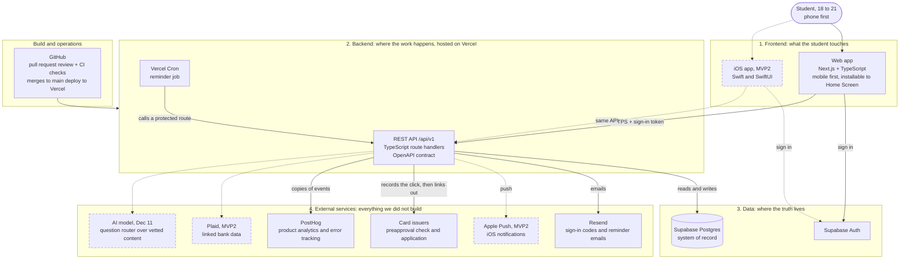

# CENSE

CENSE helps students choose a first credit card with clear, personalized guidance and build healthy credit habits afterward.

## Repository layout

- `web/` — Next.js 16, TypeScript, Tailwind CSS, shadcn/ui, Zod, and Supabase
- `ios/` — native SwiftUI app shell
- `api/openapi.yaml` — shared REST contract for web and iOS clients
- `tokens.json` — shared design tokens for both platforms

## Architecture

### Stack

| Layer | Choice |
| --- | --- |
| Frontend | Next.js 16 and TypeScript, styled with Tailwind CSS and shadcn/ui. Mobile-first web app that can be installed to the Home Screen. A native SwiftUI app follows in MVP2 and calls the same API. |
| Backend | TypeScript on Node.js. Next.js route handlers under `/api/v1`, described by `api/openapi.yaml`. Business rules run on the server only. Vercel Cron runs the reminder job. |
| Database | Supabase Postgres. Schema changes only through SQL migrations in this repo. Row level security on every table that holds user data. |
| Auth | Supabase Auth with Google and a 6-digit email code. No passwords. Sign in with Apple is added later. |
| Hosting | Vercel. Every pull request gets a preview deployment; `main` is production. |
| Email | Resend, for sign-in codes and reminders. |
| Analytics and errors | PostHog, with pseudonymous IDs. |
| Testing and CI | Vitest for unit and integration tests, Playwright for end-to-end tests (planned), GitHub Actions on every pull request. |

### Diagram

Solid boxes ship in MVP1 (Oct 26). Dashed boxes come in MVP2 (Nov 9) or by Demo Day (Dec 11).



### External services

| Service | What we use it for | When |
| --- | --- | --- |
| Supabase | Postgres database and sign-in | MVP1 |
| Vercel | Hosting, preview deployments, scheduled jobs | MVP1 |
| Resend | Sign-in codes and reminder emails | MVP1 |
| PostHog | Product analytics and error tracking | MVP1 |
| Google OAuth | "Sign in with Google" through Supabase Auth | MVP1 |
| Card issuer websites | Links out to each issuer's own preapproval check and application. No API; Cense never submits an application. | MVP1 |
| GitHub Actions | CI checks on every pull request | MVP1 |
| Plaid | Linked bank data | MVP2 |
| Apple Push Notification service | iOS notifications | MVP2 |
| An AI model (provider not chosen) | Routing questions to vetted content. It never makes the recommendation. | By Dec 11 |

### Environments

| Environment | Where it runs | Database |
| --- | --- | --- |
| Local | Your laptop, `npm run dev` | Supabase dev project |
| Preview | Vercel, one per pull request | Supabase dev project |
| Production | Vercel, from `main` | Supabase production project (created before the first real student uses the app) |

## Local setup

```bash
cd web
cp .env.example .env.local
npm install
npm run dev
```

The starter intentionally runs without credentials. Add the Supabase values when the development project is available.

Setup verified from a fresh clone by a second teammate: pending (Yunho).

## Quality checks

```bash
cd web
npm run check
```

CI runs linting, type checking, tests, a production build, secret scanning, OpenAPI validation, and an iOS simulator build on every pull request and push to `main`.

## Installed packages

| Area | Package | Purpose |
| --- | --- | --- |
| Framework | `next`, `react`, `react-dom` | Web application and server route handlers |
| Styling | `tailwindcss`, `shadcn`, `@base-ui/react`, `class-variance-authority`, `clsx`, `tailwind-merge`, `tw-animate-css`, `lucide-react` | Accessible UI components, icons, and styling |
| Data | `@supabase/supabase-js` | Authentication and database client |
| Validation/API | `zod`, `@asteasolutions/zod-to-openapi`, `openapi-typescript` | Runtime schemas and generated API contracts |
| Quality | `eslint`, `typescript`, `vitest` | Linting, type checking, and tests |

See `web/package.json` and `web/package-lock.json` for exact versions.

## Accounts and keys

Who holds each account. Key values are never stored in this repo or sent over Slack. They live in Vercel's environment variables and in the Supabase dashboard; `web/.env.example` lists the variable names.

| Account | Held by | Status (Oct 3) |
| --- | --- | --- |
| GitHub repository | Mabelle (owner) | Active |
| Vercel | Mabelle | Account exists; connection to this repo not confirmed yet |
| Supabase, dev project | Ben (organization owner); Mabelle and Yunho as admins | Created |
| Supabase, production project | Ben | Not created yet; needed before real students use the app |
| Resend | Ben | Being set up |
| PostHog | Not assigned yet | Not created yet |
| Google OAuth client | Yunho, with the sign-in work | Not created yet |
| Domain | Ben | Not purchased yet |

## How we work

- Branching, pull requests, review and merging: see [CONTRIBUTING.md](CONTRIBUTING.md).
- Project board: the team's Notion backlog holds the user stories, sub-tasks, sprints and status (link to be added here once the board is shared).
- AI Usage Log: kept in the team's Notion (link to be added here).
